# 🪐 RepoVerse

**Turn your GitHub Profile into a living, breathing universe.**

RepoVerse is an AI-powered cosmic engine that visualizes your code repositories as planets orbiting a central sun (you!). It generates an animated SVG that you can embed directly into your GitHub Profile README.



## ✨ Features

*   **Dynamic Visualization**: Each planet represents a repository.
*   **Live Data**: Fetches real stats (Stars, Language, Size) from the GitHub API.
*   **Mood Ring**: Planets change color and texture based on the "mood" of your code (e.g., "Focused" for TypeScript, "Creative" for CSS).
*   **Cosmic HUD**: An auto-cycling sci-fi data panel showing live stats for each repo.
*   **Zero Config**: Just fork and run.

## 🚀 How to Use (For Everyone)

Want this on your profile? It's easy.

### 1. Fork this Repository
Click the **Fork** button in the top-right corner of this page to create your own copy of `repo-verse`.

### 2. Enable Actions
Go to the **Actions** tab in your forked repository and enable workflows if they are disabled.

### 3. Generate Your Universe
The workflow is set to run automatically every 12 hours. To see it immediately:
1.  Go to **Actions** -> **Update Universe**.
2.  Click **Run workflow**.
3.  Wait about 30 seconds.

### 4. Add to Your Profile
Once the workflow finishes, it will update the `public/universe.svg` file in your repo.
Add this line to your **GitHub Profile README**:

```markdown

```
*(Replace `YOUR_USERNAME` with your actual GitHub username)*

## 🛠️ Advanced Configuration

### High Rate Limits
If you have a massive number of repositories, you might hit GitHub's unauthenticated API rate limits. To fix this:
1.  Create a [Personal Access Token (Classic)](https://github.com/settings/tokens).
2.  Go to your repo **Settings** -> **Secrets and variables** -> **Actions**.
3.  Add a new repository secret named `GITHUB_TOKEN` (though the default `GITHUB_TOKEN` provided by Actions usually works fine for this).

### Customization
You can tweak the physics and aesthetics in `src/lib/planet-generator.ts` and `src/lib/svg-generator.ts`.

## 💻 Local Development

1.  Clone the repo.
2.  `npm install`
3.  `npm run dev` to see the web app version at `http://localhost:3000`.
4.  `npx tsx scripts/generate.ts YOUR_USERNAME` to generate the SVG locally.

---
*Built with Next.js, Tailwind, and a lot of ☕.*
